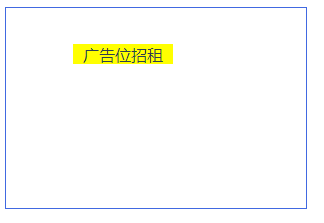

# vue2-freedom-context-menu

vue2高自由右击菜单，支持作用域选择

### 效果图



### 安装

```
npm i vue2-context-menu-freedom
```

### 在vue2中使用

```vue
<template>
	<--容器样式-->
    <div id="app" style="width: 300px; height: 200px; border: 1px solid royalblue;">
        <--右击菜单样式与作用域-->
        <ContextMenu scope="app" style="width: 100px; height: 20px; background: yellow;">
          <--右击菜单内容--->
        </ContextMenu>
  </div>
</template>

<script>
    import ContextMenu from '@/components/ContextMenu.vue';
    export default {
      components: {
        ContextMenu,
      },
      mounted() {
        // 手动关闭默认右击点击事件
        document.oncontextmenu = function () {
          return false
        }
      }
    }
</script>
```

### 插槽

| 名称  | 类型   | 默认值 | 解释                                         |
| ----- | ------ | ------ | -------------------------------------------- |
| scope | string | ''     | 右击菜单作用域。输入值为容器id，传空时为body |

### 更新日志

| 版本号 | 更新详情              |
| ------ | --------------------- |
| v1.0.0 | 正式版本，欢迎提issue |

